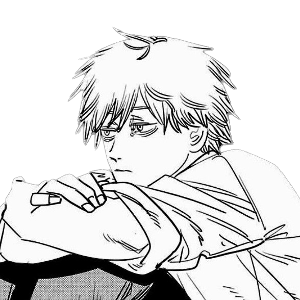

👤 **`Name`** Aleksandar Haralanov
 

💬 **`Lang`** Bulgarian, English
 
💗 **`Like`** Music, Spicy Food
 
💼 **`Does`** IT Graduate, Currently a hobby

  
<h3>GitHub Stats⚡</h3>

  
  

    
    
     
     
  

